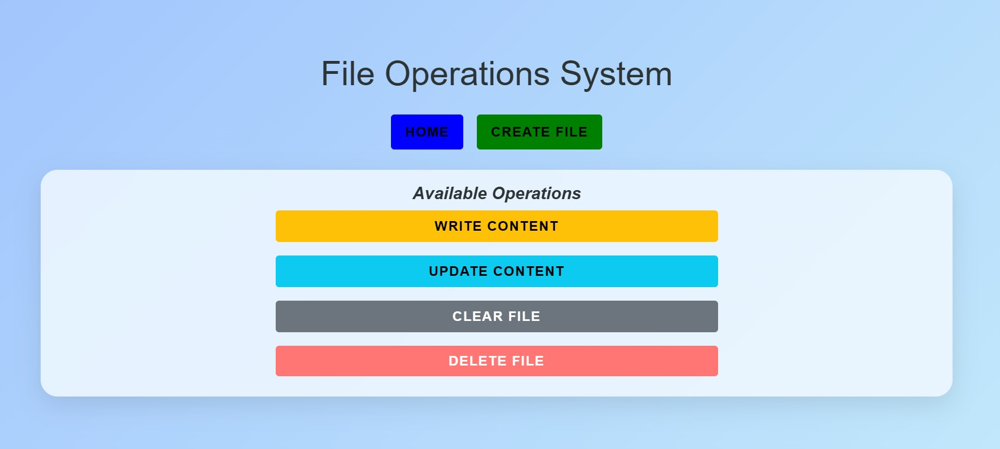

# File Operations System 🗂️

A web-based file management system built with Python and Flask that allows users to perform CRUD operations on text files with a modern UI.

 <!-- Add actual screenshot later -->

## Features ✨

- **File Operations**
  - 🆕 Create new files
  - ✏️ Update specific lines
  - 🗑️ Delete files
  - 🧹 Clear file contents
  - 👀 Preview files
  - ⬇️ Download files

- **User Interface**
  - 🎨 Modern responsive design
  - 🚀 Interactive animations
  - 📱 Mobile-friendly layout
  - 📋 Toast notifications
  - 🎯 Intuitive navigation

- **Security**
  - ✅ Input validation
  - 🛡️ Error handling
  - ⚠️ Delete confirmation

## Technologies Used 💻

**Backend**
- Python 3
- Flask (Web framework)
- File handling operations

**Frontend**
- HTML5 & CSS3
- Bootstrap 5
- Font Awesome Icons
- Custom animations

## Installation ⚙️

1. **Clone the repository**
   ```bash
   git clone https://github.com/yourusername/file-operations-system.git
   cd file-operations-system
   ```

2. **Create virtual environment**
   ```bash
   python -m venv venv
   source venv/bin/activate  # On Windows: venv\Scripts\activate
   ```
   
3. **Install dependencies**
   ```bash
   pip install -r requirements.txt
   ```
   
4. **Create necessary directories**
   ```bash
   mkdir -p files static/css templates
   ```
   
## Usage 🚀  
1. **Start the application**
   ```bash
   python app.py
   ```
   
2. **Access the web interface**
   ```bash
   http://localhost:5000
   ```
   
3. **Available Operations**

- **`Create File`**: Click on `Create File` button
- **`Write File`**: Click on `Write Content` button
- **`Update Content`**: Use line number to update specific line
- **`Clear File Content`**: To clear file click on `Clear File` button
- **`Delete File`**: To permanently delete a file click on `Delete File` button
- **`Download Files`**: Click download button

## Directory Structure 📂

```text
file_operations_webapp/
├── files/                       # User-created files
├── requirements.txt             # Dependencies
├── project_screen_short/        # Project screen short
├── app.py                       # Main application entry
├── file_operation.py            # File operation logic
├── templates/                   # HTML templates
│   ├── base.html                # Base template 
│   ├── index.html               # Project main/home html file
│   ├── create.html              # File creation
│   ├── write.html               # Writes file
│   ├── read.html                # Reads file
│   ├── update.html              # Line editing
│   ├── clear.html               # Clean file contents
│   └── delete.html              # Delete file permanently 
├── static/                      # It includes CSS files, JavaScript files, and images
│   └── css/                     # Custom styles folder
│       └── style.css            # Custom styles file
├── .gitignore                   # ignore unwanted files/folders
└── README.md                    # Project documentation

```

## API Endpoints 🌐

```text
| Endpoint               | Method         | Description                        |
|------------------------|----------------|------------------------------------|
| `/`                    | `GET`          | Displays the main html file.       |
| `/create`              | [`GET`,`POST`] | Creates a new file.                |
| `/write`               | [`GET`,`POST`] | Writes in specific file            |
| `/read/<filename>`     | `GET`          | Reads a specific file.             |
| `/delete`              | [`GET`,`POST`] | Deletes a specific file.           |
| `/update`              | [`GET`,`POST`] | Edits a specific line in the file  |
| `/download/<filename>` | `GET`          | Downloads a specific file.         |
| `/clear`               |[`GET`,`POST`]  | Clear the file contents            |

```

